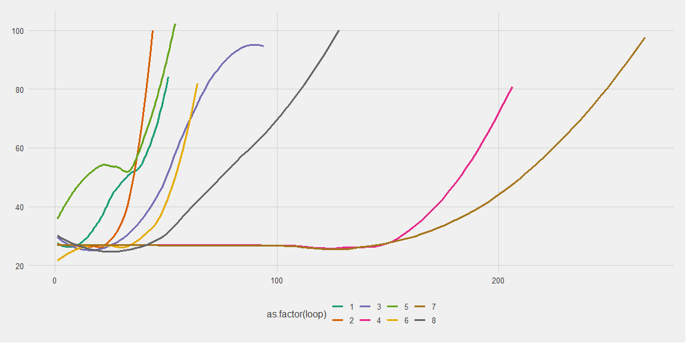

```r
# Use this R-Chunk to import all your datasets!
output <- read_csv("output_1.csv", 
    col_names = paste0("V",seq_len(500)))

output_2 <- read_csv("output_2.csv", 
    col_names = paste0("V",seq_len(500)))
```

## Data Wrangling


```r
# Use this R-Chunk to clean & wrangle your data!
output <- output %>% 
  mutate(loop = row_number()) %>%
  select(loop, 1:500) %>% 
  gather(key = 'times', value = 'precent', c(2:501)) %>% 
  mutate(times = as.numeric(str_remove_all(.$times, 'V'))) 

output %>% arrange(loop) %>% View()

output_2 <- output_2 %>% 
  mutate(loop = row_number()) %>%
  select(loop, 1:500) %>% 
  gather(key = 'times', value = 'precent', c(2:501)) %>% 
  mutate(times = as.numeric(str_remove_all(.$times, 'V'))) 
```


## Source code

Provide a link to your GitHub repository for the code you wrote.

## Approach

I picked the implementation approach and my classifier will learn and take in a validation set to compare. I utilized objects for my algorithm and store the activation value and error. My classifier will build a network according to the input and output while the user could decide how many layers and nodes should the network builds. 
    Challenges
The toughest part in my opinion is the building part, while the learning/ training part involves some calculation and data manipulation, the building part takes in account many aspects. It took my awhile tell the program to build proper numbers of weights. I also spent some time understand how a dot productor works with two vectors.


## Results


Make sure to include evidence (description, graphs, results, etc.) that demonstrate each of the items listed in the minimum standards above.


```r
output %>%   
filter(!is.na(precent)) %>% 
ggplot() +
  aes(y = precent * 100, x = times, group = as.factor(loop), colour = as.factor(loop)) +
  geom_smooth(se = F) +
  scale_color_brewer(palette = 'Dark2') +
  ggthemes::theme_fivethirtyeight()
```

<!-- -->

```r
output_2 %>% 
  ggplot() +
  aes(y = precent * 100, x = times, group = as.factor(loop), colour = as.factor(loop)) +
  geom_smooth(se = F) +
  scale_color_brewer(palette = 'Accent') +
  ggthemes::theme_fivethirtyeight()
```

<!-- -->

## Above and Beyond

Describe any efforts you made to go above and beyond.

Assessment


D) Meets requirements


## Data Visualization


